

Age-associated co-expression networks and genomic ERV annotations in GTEx v10 skeletal muscle.

  
<b>GTEx v10</b> RNA-seq counts

  
<b>Preprocessing</b> filter + VST

  
<b>WGCNA</b> signed network

  
<b>Age modules</b> 7 candidates

  
<b>ERV positions</b> promoter + distance

  
<b>Integration</b> hubs + enhancers

# 1. Dataset and preprocessing

  

818

skeletal muscle samples

  

59,033

input genes

  

43,186

after count filtering

  

20,000

top genes by MAD for WGCNA

| Step | Setting / output |
|---|---:|
| Count filter | row sum >= 50 |
| Transformation | DESeq2 VST (`design = ~ 1`) |
| Network | signed |
| Soft-thresholding power | 6 |
| Minimum module size | 30 |
| Merge cut height | 0.25 |
| Detected modules | 32 + grey |

  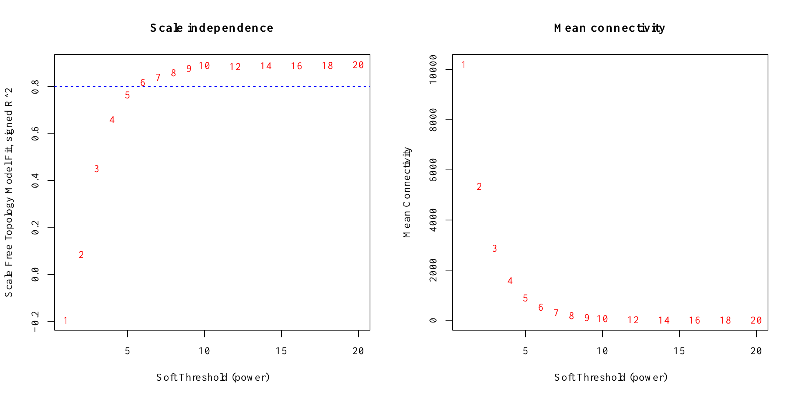

Soft-thresholding analysis. Power 6 was selected for the signed network.

# 2. Module-trait relationships

Age was encoded as six ordered decade groups (20-29 to 70-79).

  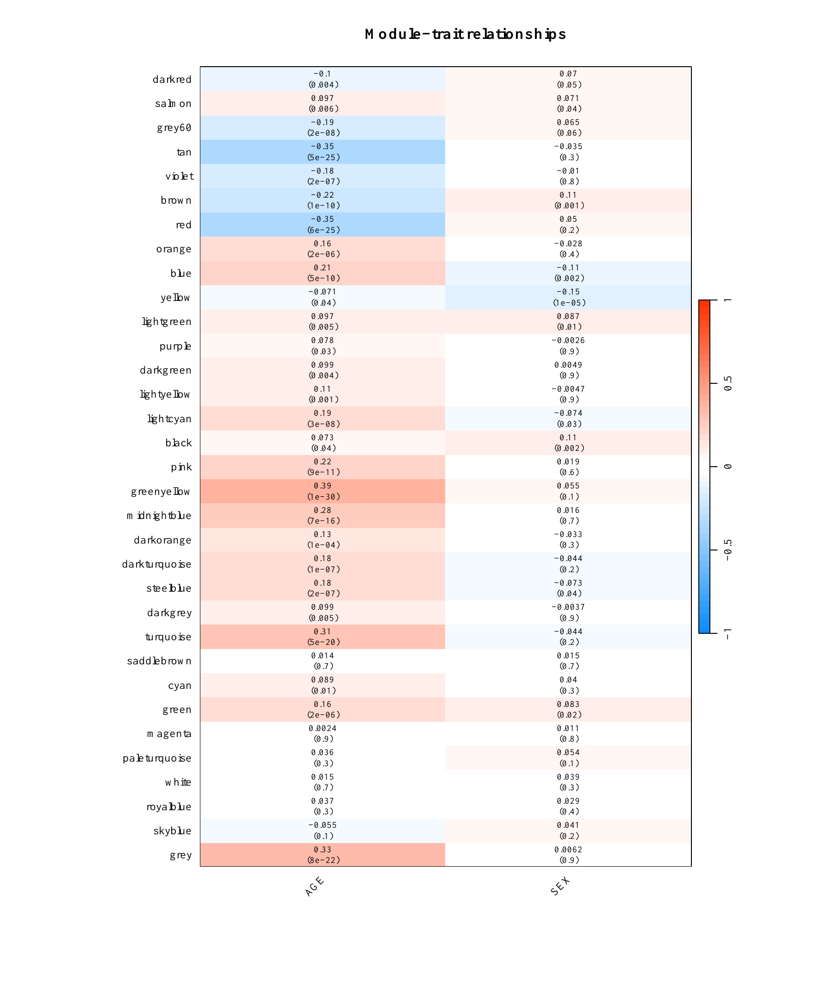

Module eigengene correlations with AGE and SEX.

| Candidate module | Genes | AGE correlation | AGE P value |
|---|---:|---:|---:|
| greenyellow | 445 | 0.387 | 1.18e-30 |
| red | 630 | -0.350 | 6.17e-25 |
| darkgreen | 119 | 0.099 | 4.45e-03 |
| turquoise | 2,608 | 0.313 | 4.85e-20 |
| midnightblue | 328 | 0.277 | 6.79e-16 |
| blue | 2,499 | 0.215 | 5.32e-10 |
| pink | 606 | 0.224 | 8.68e-11 |

<b>Largest positive AGE correlation:</b> greenyellow, r = 0.387.

# 3. GenAge overlap

  

191

GenAge genes in WGCNA

  

3

GenAge genes among 210 hubs

  

10

pink module overlaps

  

0 / 7

modules significant at FDR &lt; 0.05

  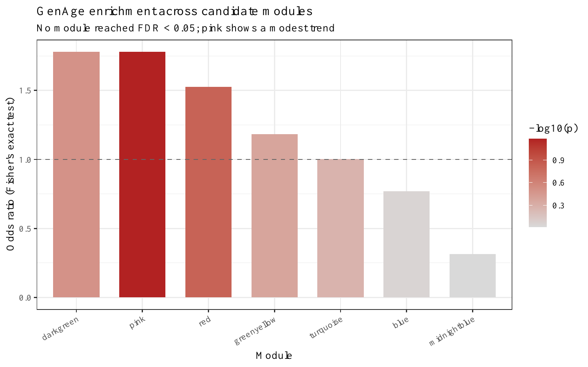

GenAge enrichment across the seven candidate modules.

| Module | GenAge overlap | Odds ratio | FDR |
|---|---:|---:|---:|
| pink | 10 | 1.779 | 0.466 |
| red | 9 | 1.526 | 0.528 |
| darkgreen | 2 | 1.779 | 0.735 |
| greenyellow | 5 | 1.182 | 0.738 |
| turquoise | 25 | 1.003 | 0.738 |
| blue | 19 | 0.771 | 0.958 |
| midnightblue | 1 | 0.314 | 0.958 |

# 4. Module-level ERV annotation

Promoter-proximal region: TSS -2,000 bp to +500 bp.

  

19,968

position-eligible genes

  

4,765

genes with promoter ERV

  

23.86%

background promoter ERV rate

  

8,174

gene-ERV promoter pairs

::: {.figure-grid}

::: {.figure-panel}
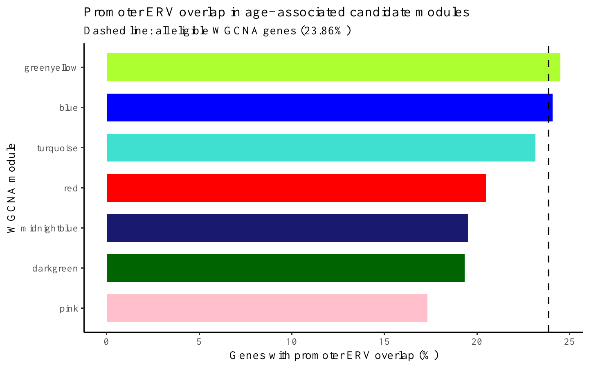

Promoter ERV overlap by candidate module.

:::

::: {.figure-panel}
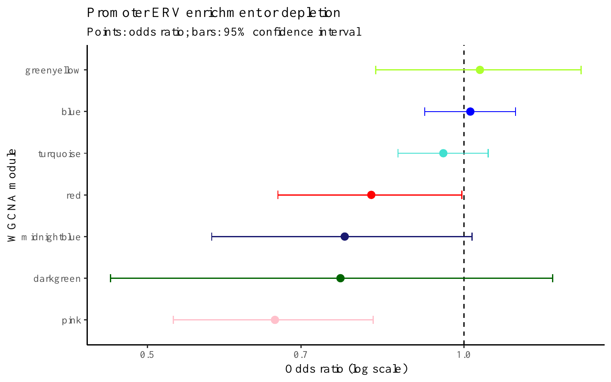

Fisher's exact tests for promoter ERV enrichment or depletion.

:::

:::

<b>pink:</b> 17.3% vs 24.1% in other genes; OR = 0.661, FDR = 0.00060.

::: {.figure-grid}

::: {.figure-panel}
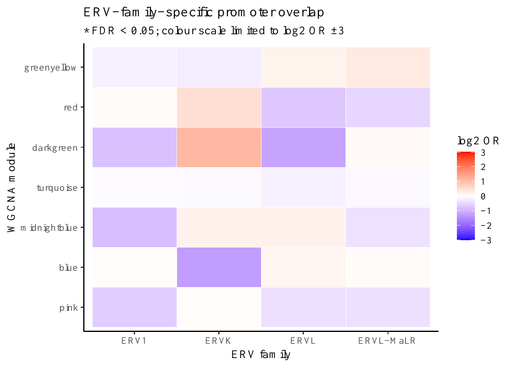

Family-specific promoter overlap. No family-module pair reached FDR &lt; 0.05.

:::

::: {.figure-panel}
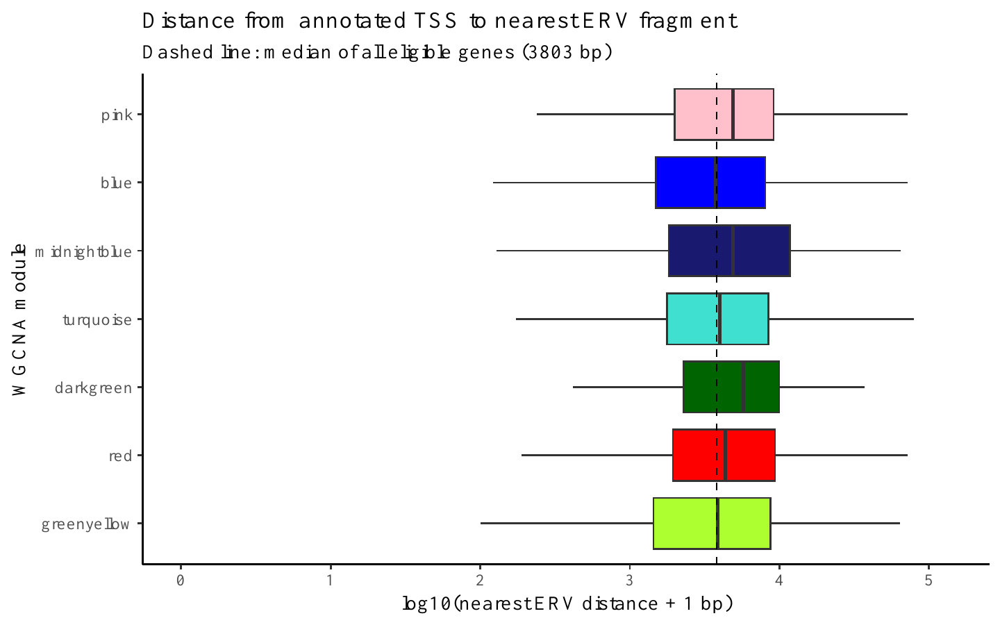

Distance from TSS to the nearest annotated ERV fragment.

:::

:::

| Module | Promoter ERV (%) | OR | FDR | Median nearest ERV (bp) | Distance FDR |
|---|---:|---:|---:|---:|---:|
| greenyellow | 24.5 | 1.036 | 0.783 | 3,877 | 0.754 |
| red | 20.5 | 0.817 | 0.157 | 4,364 | 0.00723 |
| darkgreen | 19.3 | 0.763 | 0.492 | 5,739 | 0.0212 |
| turquoise | 23.2 | 0.956 | 0.525 | 3,992 | 0.0377 |
| midnightblue | 19.5 | 0.770 | 0.157 | 4,892 | 0.00348 |
| blue | 24.1 | 1.014 | 0.783 | 3,742 | 0.121 |
| pink | 17.3 | 0.661 | **0.00060** | 4,884 | **0.00268** |

<b>Nearest ERV distance:</b> red, darkgreen, turquoise, midnightblue and pink were significantly farther than other eligible genes (FDR &lt; 0.05).

# 5. Hub-gene integration

  

210

top hubs: 7 modules x 30

  

33

hubs with promoter ERV (15.7%)

  

63

hub-ERV promoter pairs

  

3

GenAge hubs

::: {.figure-grid}

::: {.figure-panel}
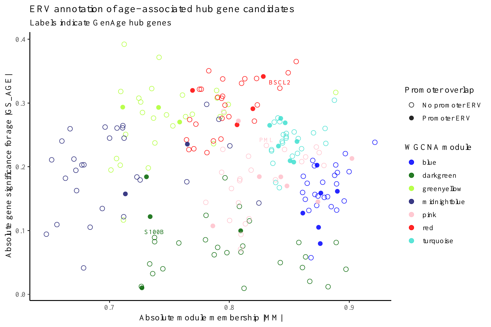

Module membership, age significance and promoter ERV status.

:::

::: {.figure-panel}
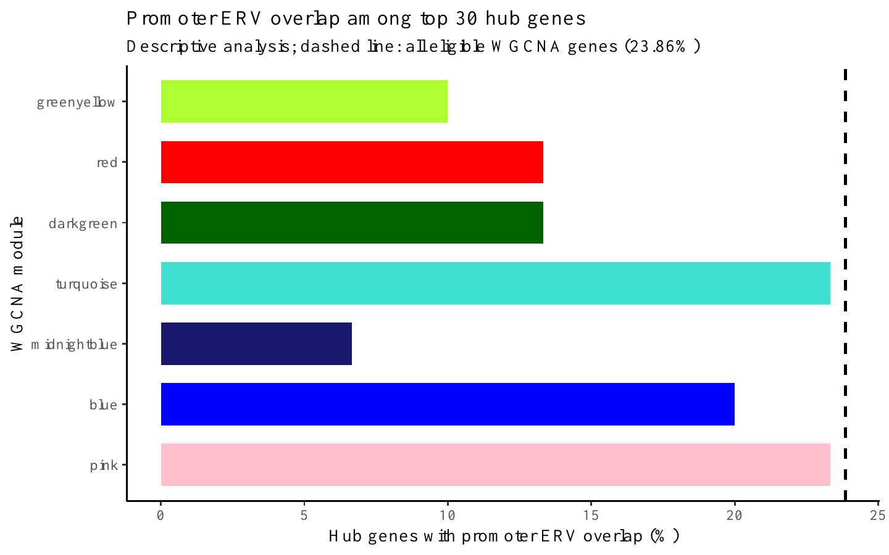

Promoter ERV overlap among the top 30 hubs per module.

:::

:::

| GenAge hub | Module | Rank | MM | GS-AGE | Promoter ERV | Nearest ERV |
|---|---|---:|---:|---:|---|---:|
| BSCL2 | red | 3 | 0.842 | -0.323 | No | 9,815 bp |
| S100B | darkgreen | 24 | 0.738 | 0.089 | No | 2,010 bp |
| PML | pink | 12 | 0.831 | 0.233 | No | 1,555 bp |

  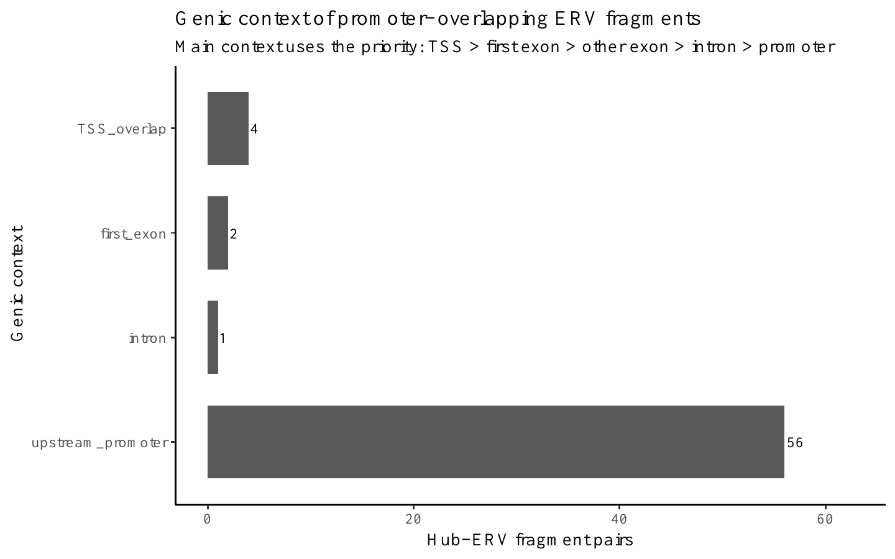

Most promoter-overlapping hub-ERV pairs were upstream of the annotated TSS.

# 6. Skeletal-muscle enhancer integration

Roadmap E100 (Psoas muscle) and E108 (Skeletal muscle male).

  

15,779

enhancer-associated ERV fragments

  

4,418

supported in both epigenomes

  

135 / 210

hubs within 100 kb (64.3%)

  

63 / 210

hubs near consensus ERVs (30.0%)

::: {.figure-grid}

::: {.figure-panel}
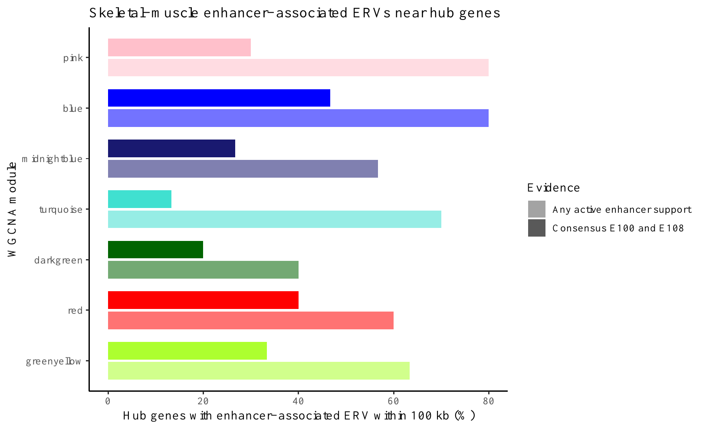

Hub genes with enhancer-associated ERVs within 100 kb.

:::

::: {.figure-panel}
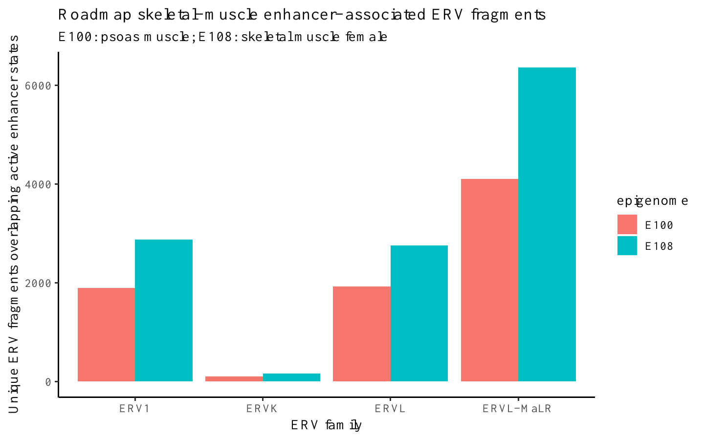

Unique enhancer-associated ERV fragments by family and epigenome.

:::

:::

| Module | Hubs near enhancer ERV (%) | Consensus support (%) |
|---|---:|---:|
| greenyellow | 63.3 | 33.3 |
| red | 60.0 | 40.0 |
| darkgreen | 40.0 | 20.0 |
| turquoise | 70.0 | 13.3 |
| midnightblue | 56.7 | 26.7 |
| blue | 80.0 | 46.7 |
| pink | 80.0 | 30.0 |

<b>PML:</b> GenAge hub with three enhancer-associated ERV candidates within 100 kb; one was supported in both muscle epigenomes (minimum distance 11,962 bp).

# 7. Current status

| Completed | Next |
|---|---|
| GTEx preprocessing | Postmortem covariate assessment |
| WGCNA and module-trait analysis | ERV expression quantification |
| GenAge annotation | Multivariable validation |
| Promoter and nearest-ERV annotation | Final candidate prioritisation |
| Hub and Roadmap enhancer integration | Dissertation figures and interpretation |

<b>Interpretation:</b> Current ERV results are reference-genome positional annotations; they do not demonstrate ERV expression or regulatory activity. The source files are GTEx v10, although the repository README still contains an outdated v8 label.

